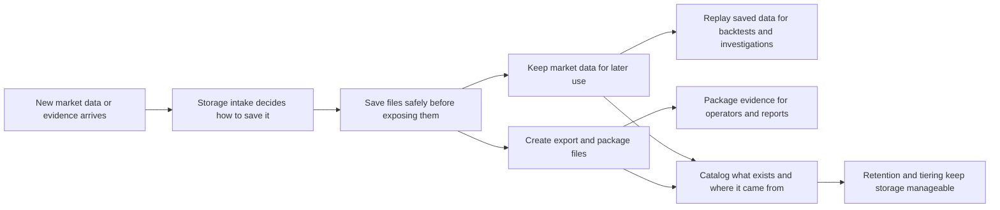
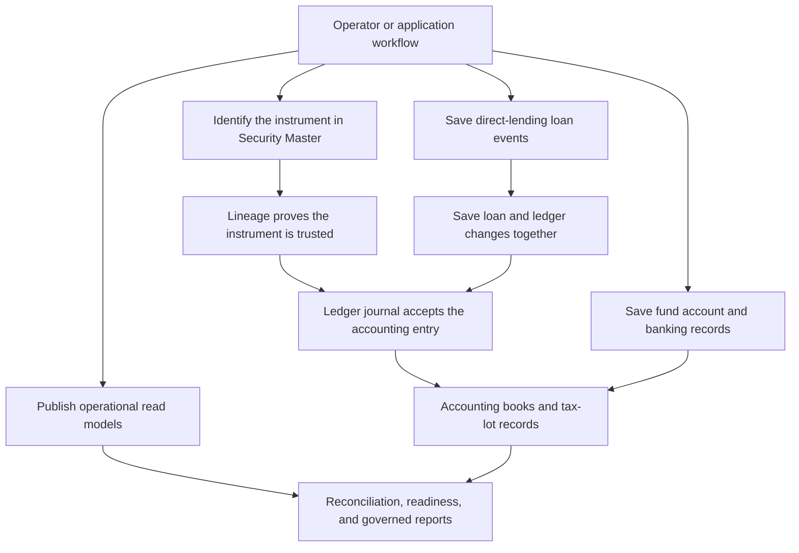

# src/Meridian.Storage

## Purpose

`src/Meridian.Storage` is Meridian's record-keeping layer. When market data, accounting entries,
loan events, exports, or operator evidence need to survive a restart, this project decides where and
how those records are saved.

Storage answers three questions:

1. **Can we keep this record safely?** Durable writes go through guarded helpers before they become
   evidence. A write-ahead log records the intended change first, so Meridian can recover or replay
   the write after a crash. An atomic file writer writes a complete replacement file first, then
   swaps it into place so readers do not see a half-written file.
2. **Where can we find it later?** Catalog, lineage, quality, search, and replay services track
   saved records so operators can locate them for audits, backtests, reconciliations, and reports.
3. **Where is the data coming from?** Ledger, Security Master, fund-account, and asset-operation
   stores keep source and approval details so accounting and investment-operation decisions can be
   explained later.

## Layer responsibility

Storage is responsible for saving, retrieving, and protecting records reliably. Other Meridian
layers decide the user workflow and screen presentation; Storage supplies the durable records,
lookup paths, and evidence trails those layers rely on.

## Key folders and files

- `Archival/` - safety tools for file-backed records, including the write-ahead log and atomic file
  writer.
- `Backfill/` - durable last-run backfill status plus per-symbol checkpoint and bar-count sidecars
  published under `Meridian.Storage.Backfill`.
- `Config/StorageConfigExtensions.cs` - Storage-owned mapping from shared `StorageConfig` values
  into `StorageOptions`, including naming convention, date partition, sink, and profile defaults.
- `Coordination/` - file-backed shared-storage lease store implementation published under
  `Meridian.Storage.Coordination` for contracts-owned `Meridian.Contracts.Coordination` records.
- `Etl/` - ETL staging, audit, reject, and local JSON job-definition stores.
- `Interfaces/` and `Sinks/` - contracts and implementations that receive data to be saved.
- `Store/`, `Policies/`, and `Replay/` - JSONL market-data storage, rules for using it, and readers
  that can play saved data back. Replay k-way merges every physical JSONL or compressed JSONL file
  by full UTC ticks with stable file-order ties, and fails closed with file/line evidence on
  malformed, null, or per-file time-regressing records rather than silently omitting them.
  `JsonFileIBDataResultStore` requires tenant/company scope on writes
  and queries, keys matching result identities by that scope, and excludes unscoped legacy rows
  during restart hydration.
- `Services/CanonicalSymbolRegistry.cs` - storage-backed canonical symbol resolver implementing
  the contracts-owned `ICanonicalSymbolRegistry` over the symbol registry store.
- `Ledger/` - authoritative accounting journal storage, source-event queries, tax-lot policy inputs,
  and dimension/command guardrails for instrument and book-position postings.
- `Integrations/` - file-backed provider integration manifest, connection, raw payload,
  quarantine, quarantine-review decision, quarantine replay payload, staging-record, and
  reconciliation-handoff evidence persistence for replayable no-code provider intake.
- `Operations/` - the shared append-only operational case-history implementation. It assigns a
  global sequence and SHA-256 predecessor/current hash, verifies the complete chain before reads or
  writes, rejects duplicate event identities and corrupt retained data, and uses an OS lock plus
  `AtomicFileWriter` copy-on-write append for browser/WPF processes sharing one data root.
- `SecurityMaster/` - reference-data stores that identify securities and preserve provenance.
- `DirectLending/` - direct-lending state, events, workflow audit, and transactional ledger handoff.
- `AssetOperations/` - read-model projections for operational terms, lifecycle, cash flow,
  reconciliation, readiness, and evidence views.
- `FundAccounts/`, `Banking/`, and `FundStructure/` - fund accounts, balances, statements, banking
  records, and fund-structure persistence. Banking transaction persistence keeps bank-side evidence
  amounts, dates, external references, void posture, and retaining operator identity durable for
  cash-reconciliation audit packages. `FundStructure` owns the local JSON and in-memory
  fund-structure state stores, while PostgreSQL fund-structure service persistence stays in the
  storage-backed rows and migrations.
- `Reporting/` - tenant-bound PostgreSQL storage for immutable report bytes and catalogs, governed
  revisions, restatement requests, exact close/reconciliation receipts, append-only lifecycle and
  access audit chains, certified run manifests and run audit, scoped schedule snapshots, opaque
  access-grant state, durable delivery jobs, and provider receipts.
  Reporting migrations share a schema-scoped advisory lock and checksummed migration ledger;
  immutable rows and authority/payload fields are guarded against update or deletion. The store uses
  `MERIDIAN_REPORTING_CONNECTION_STRING` with the intentional ledger-connection fallback and
  `MERIDIAN_REPORTING_SCHEMA` (default `reporting`). Migration `010_reporting_operational_state.sql`
  adds tenant-bound run snapshots and tenant/company-bound schedule snapshots with canonical JSON
  digests and indexed identity checks. The live deployment probe also verifies the reporting
  migration-ledger key and non-null checksum, immediate non-expression conflict/idempotency keys,
  and the predicate-bound access-grant delivery key. When the reporting connection is absent, UI
  Shared can register file-backed run, schedule, custom-template, and starter-kit compatibility
  stores for local development, but the independent Reporting deployment capability remains
  blocked. Legacy file workflow and delivery-history repositories are not part of the default host
  composition and remain available only to explicitly constructed compatibility callers.
  Production omits all of these file authorities; they are not production recovery authority.
  Migration `013_reporting_statement_reconciliation_authority.sql` adds the exact
  tenant/company/workflow/document mapping and append-only mapping revisions for statement intake,
  evidence, snapshots, and JSON/CSV support artifacts. Those mappings reference the existing
  immutable artifact blobs; `PostgresStatementReconciliationReportAuthorityStore` verifies bytes on
  read and holds a session advisory lease while one host advances a workflow. The live deployment
  probe requires both statement-authority tables, the document guard/revision and revision
  append/guard triggers, and the exact `reporting-statement-reconciliation-authority:v1`
  compatibility marker. Production readiness additionally requires the concrete PostgreSQL store;
  a migration receipt or compatible-looking schema without that store does not certify the
  statement authority.
- `Runtime/` - atomic JSON storage for the latest host lifecycle shutdown receipt. Installed
  supervisor session receipts remain below the supervisor-managed data root and use the same
  write-through-then-rename durability posture.
- `Packaging/`, `Export/`, and `Maintenance/` - portable data packages, analysis exports, retention,
  tiering, and scheduled cleanup. CSV exports route headers and values through the shared
  spreadsheet-formula guard, including semicolon-locale segments, and quote commas, semicolons,
  tabs, quotes, carriage returns, and line feeds before publishing an artifact. The shared XLSX
  writer fixes ZIP entry timestamps and platform attributes so identical workbook inputs produce
  byte-identical artifacts and stable retained hashes.
- `Services/QualityTrendStore.cs` - crash-safe append-only quality history. New score events retain
  immutable input snapshots, input and canonical result SHA-256 identities, and a verified
  quality-evaluation outcome. Sequence/predecessor hashes, a durable chain head, deterministic
  pending-append recovery, and evaluation-id idempotency detect deletion, reordering, duplicate
  retries, malformed rows, and semantic edits instead of silently skipping them. Scores enter the
  process cache only after durable append succeeds; evaluation or retention failures return a
  validated Failed/Blocked receipt and retain the fallback receipt under `quality/outcomes/`.

## Important workflows

### Operational case history

`FileOperationalCaseHistoryStore` persists Contracts-owned workflow transitions, actors, reasons,
assignments, retries, exceptions, input hashes, approvals, evidence, artifacts, recovery attempts,
terminal receipts, and bounded source-owned replay data at
`<DataRoot>/operations/case-history.jsonl`. Reads validate the whole global chain before filtering
by case or case type, so corruption is surfaced instead of skipped or silently truncated. The
browser and WPF composition roots share this same data-root-backed port; source modules such as
Strategies project their compatible read models from the retained history without depending on
Storage directly. Chain-head checkpoints are finalized without caller cancellation after the JSONL
commit, retry transient checkpoint failures, and surface an explicit post-commit exception carrying
the committed record when repair remains pending so callers never infer that durable work rolled
back.

Maintenance executions compose the shared terminal-outcome contract. Index rebuild invokes the
real `IStorageSearchService`; when that dependency is absent the operation returns `Blocked`
instead of claiming a no-op success. A successful rebuild must supply canonical before, staged,
and read-back item counts and SHA-256 snapshots; missing, incomplete, or mismatched proof blocks or
fails the operation. Scheduled, running, and terminal maintenance transitions are
retained through the same case-history spine when a durable history store is configured. Quality
maintenance distinguishes complete success, partial `CompletedWithWarnings`, total failure, and
no-input blocking from attempted/succeeded/failed input counts; cancelled work is not converted to
a false terminal failure.

Archive-maintenance schedule mutations persist a validated candidate snapshot before publishing it
to readers under an in-process gate and a cross-process file lease; revision-aware replacements
reject stale snapshots while legacy revision-zero callers retain deterministic merge compatibility.
Retained invalid schedules are durably disabled with repair evidence, unreadable source documents
are copied to the maintenance quarantine, and the exact legacy monthly-compression preset is
migrated to the explicit first-Sunday expression `0 1 * * 0#1` without rewriting custom POSIX
schedules. Due and manually triggered executions create a durable claim/outbox record in the same
schedule snapshot that advances the occurrence. Active services renew the claim lease, restarts
requeue an unpublished occurrence with the same execution identity, and an expired claim already
marked running is retained as an interrupted/ambiguous failure instead of being replayed blindly.

### Market data and evidence

Market data and evidence records enter through storage sinks. File-backed writes use the
write-ahead log or atomic file helpers so a crash is less likely to leave a half-written record.
Storage sink flush behavior uses the Core-owned `Meridian.Core.Services.IFlushable` contract rather
than an Application service dependency. Saved records feed replay, packaging, exports, catalog
lookup, lineage checks, quality scoring, and maintenance jobs.

Replay readers validate each physical stream's monotonic timestamp contract and merge one buffered
record per file. This preserves deterministic mixed bar, quote, trade, and depth chronology across
the supported directory and flat layouts without materializing the whole dataset; callers must
still budget one open stream per physical replay file.

Backfill status and checkpoint sidecars are Storage-owned durable records published under
`Meridian.Storage.Backfill`. They persist the shared Contracts-owned
`Meridian.Contracts.Backfill` result payload plus per-symbol checkpoint and bar-count maps under
the storage root through `AtomicFileWriter`, allowing interrupted jobs to resume without
Application owning file persistence details.

Adaptive partition placement recommendations are Storage-owned through
`AdaptivePartitionPlacementPlanner`. The planner converts observed event volume, coverage window,
symbol count, provider/source breadth, and event-type breadth into a recommended
`PartitionStrategy` plus storage profile, then maps the recommendation back to concrete
path-driving `StorageOptions` fields. Backfill orchestration opts into those recommendations for
request-scoped placement while broader tier-promotion automation remains a separate workflow.

Shared-storage coordination lease persistence is Storage-owned durable state. The
`SharedStorageCoordinationStore` in `Meridian.Storage.Coordination` persists Contracts-owned
lease records under the configured
coordination root with per-resource lock files and `AtomicFileWriter`; Platform owns lease renewal,
coordinator election, split-brain detection, scheduled-work ownership, and subscription ownership
decisions, while Application consumes those services through the shared contracts.
Lease, position-snapshot, and other identity-partitioned file paths use the Core rooted-path guard:
identifiers remain one validated component, resolved paths must stay beneath the configured root,
and links/reparse points at either the configured root or an existing descendant are rejected before
reads, writes, locks, or deletes.
Unsafe identifiers fail without creating a sanitized alias or touching a sibling path.

Storage profile presets preserve existing persisted identifiers. The default profile ID remains
`Research` for compatibility, while APIs and operator surfaces display that preset as `Strategy`
for historical analysis, backtesting, and paper-validation preparation. The `Archival` preset keeps
long-retention evidence moving through hot, warm, cold, and archive tiers. Tier migration verifies
copied payload checksums before deleting source evidence when a rollover is configured to move
rather than copy files, and rejects non-positive parallelism before touching hot-tier or target-tier
files so operator misconfiguration cannot hang a migration or delete evidence.
`Config/StorageConfigExtensions.cs` keeps the shared AppConfig storage
section-to-`StorageOptions` mapping in the same project that owns the durable storage option types
and profile presets.

Canonical symbol resolution is Storage-owned because it wraps the durable symbol registry and its
identifier indexes. Application composition registers the Storage implementation behind
`Meridian.Contracts.Catalog.ICanonicalSymbolRegistry` for canonicalization and Security Master seed
workflows.
Security Master identifier lookup preserves provider authority: a provider-bound canonical
identifier resolves only for the exact normalized provider. The legacy primary-identifier fallback
is available only for providerless records that have no authoritative identifier row, so an omitted
or incorrect provider cannot select a provider-bound security.
The optional atomic-migration capability builds the complete candidate registry and lookup caches
off to the side, persists that candidate through `AtomicFileWriter`, and publishes it only after
the durable replacement succeeds. Conflict, cancellation, or write failure leaves both the live
registry and migration marker unchanged.

Fund-account and fund-structure legacy JSON imports are bounded and replay-safe. Startup submits a
typed snapshot to the PostgreSQL store, which takes a schema-scoped advisory lock and writes all
rows plus a domain-specific source SHA-256 receipt in one serializable transaction. Fund-account
imports include statement batches and lines, and fund-structure emptiness covers every imported
entity table. Fund structure also persists the legacy linked-account identity set independently
from active links and assignments, so disconnected account nodes keep their type and uniqueness
semantics after restart. After `Imported` or receipt-backed `AlreadyImported`, startup atomically
claims and re-hashes the exact source bytes before archival; a pending claim is recoverable after
process failure. Cancellation, rollback, a hash mismatch, or a non-empty store retains the source
for operator recovery.

### Accounting and Security Master evidence

Ledger journal writes fail closed for instrument-bearing postings. In practice, this means Meridian
will not save a securities, dividend, accrued-interest, corporate-action, option, futures, short, or
symbol-scoped accounting line unless the line carries approved Security Master provenance and ledger
mapping evidence for the same instrument. This prevents an accounting entry from claiming one
symbol at the journal level while posting a different instrument line underneath it. Until durable
journal writes carry line-level Security Master ids, one journal entry may not combine multiple
instrument symbols behind one entry-level Security Master id.

Ledger journal writes that opt into treasury-ledger metadata also fail closed. When a posting carries
effective-date, idempotency, fund-event, capital-account, investor, payment-intent, or settlement
metadata, `LedgerPeriodPostingGuard` requires an effective date inside the target accounting period
and a non-empty idempotency key before the write can reach Postgres. Partial fund-event context must
also include fund event id, fund event type, and capital account id so private-capital postings can
be reconstructed from durable journal evidence. Postgres journal storage also keeps partial unique
indexes for aggregate-scoped command id, source event id, and normalized metadata idempotency key so
retry attempts fail closed at the durable ledger boundary instead of relying only on caller-side
checks. When LedgerJournalEntryWrite carries an AccountingPostingCommandDto, storage normalizes the write metadata from that command and rejects missing command identity, mismatched aggregate/period/ledger-book scope, pending reviewer state, non-human material origin, missing evidence/rationale, or correction intents without source journal lineage before append.
Canonical `AssetAccounting.*` commands use the stricter evidence contract: operator rationale and
string links are navigation only, and storage requires complete typed retained identity, SHA-256,
source reference, accepted reviewer, UTC review/retention timestamps, effective date, positive
version, retained-by actor, and subject scope before append.
The durable aggregate remains `JournalEntry` with balanced child `LedgerEntry` rows. Candidate
journals, Asset Operations economic state, projection events, and balance snapshots are not accepted
as alternate accounting facts.
Retained journal aggregates are sealed at the posting transaction's deferred boundary. Parent and
leg inserts share a transaction-scoped per-entry lock, and initial legs require a short-lived open
marker owned by the parent transaction. A racing or later child therefore fails closed even from a
repeatable-read snapshot that cannot observe a newly committed seal. Migration backfill holds both
journal tables against writers until validation, sealing, and trigger installation complete.

Ledger period close writes also fail closed for reviewed automation. `PostgresLedgerBookService`
rejects assistant or automation-origin close requests before saving the period status, period-close
event, or operator inbox sign-off work item so period locks remain human-approved accounting
records.
Hard close additionally hydrates the period journal and refuses the status mutation while any
dimension-scoped Revenue or Expense balance remains non-zero. Closing-entry projection and approval
stay in the shared workbench; Storage owns the final invariant at the durable period boundary.
Governed restatement can move only a hard-closed period back to soft close, and only for a human
Controller or Fund Controller command with a reason, approval reference, and one retained evidence
artifact that identifies the period, ledger book, reversal/restatement intent, and approval. The
reopen event retains the prior status and clears the hard-close timestamp so subsequent writes still
flow through the existing soft-close adjustment approval guard.

Ledger tax-lot state is stored as account-scoped policy records plus open-lot records in the ledger
schema. The storage layer keeps the FIFO/LIFO/HIFO/SpecificId policy inputs and open-lot balances;
relief projection, approval workflow, and tax-reporting exports remain outside this project.
Closed-period trial-balance financials now preserve the dimension envelope available on retained
journal metadata when building report rows. The ledger book service groups balances by account and
dimension key, then fills the book fund profile as the default fund dimension, so entity,
strategy, capital-account, instrument, cost-center, counterparty, and external GL context is not
lost before browser, WPF, reporting, or export callers consume the shared report DTO.
When a governed draft candidate emits line-entry keyed dimension tags, closed-period financials
prefer those line-specific dimensions before falling back to journal-level tags. This lets generated
multi-line postings retain different cost-center or external-GL scope per line while the underlying
ledger engine remains immutable and posting-gated.
Ledger-period summaries count open reconciliation breaks only when the operator work item carries
explicit ledger-period or ledger-book scope in its route, audit reference, or scope metadata; global
inbox breaks no longer leak into unrelated book closes.
New ledger writes persist the first-class `LedgerEntry.Dimensions` value into
`journal_legs.dimensions` as JSONB and rehydrate it with each ledger line. The metadata-tag path
remains a compatibility fallback for older retained rows, but new dimensional accounting evidence
should use the line property so reports, external-GL mapping, close checks, and future query
filters do not have to infer line scope from journal-level tags. The journal store canonicalizes
line dimensions before storage, query containment, and rehydration so fund, entity, sleeve,
strategy, investor, capital-account, instrument, book-position, tax-lot, cost-center, counterparty,
external GL, and customer-neutral scope values use the same trimmed durable shape.
`PositionId` is stored inside the existing dimensions JSONB envelope and retained through closed-
period hydration and report filtering; it does not require a new journal column or position-balance
table.
`PostgresLedgerJournalStore.QueryAsync` provides the first durable journal-read seam for those
line dimensions: callers can combine ledger-book, period, aggregate, account, posting-date,
accounting-effective-date, and line-level dimension filters. Effective-date filters use retained
`JournalEntryMetadata.EffectiveDate` with the UTC posting date only as a legacy fallback, so
late-posted adjustments and reversals remain visible to period reconciliation. The store applies
line-dimension filters against `journal_legs.dimensions` instead of
guessing scope from account names or browser/WPF state. Empty queries fail before opening a
connection so production journal reads stay explicitly scoped. Account and line-dimension filters
first identify matching journal entries, then rehydrate every retained leg for those entries, so
durable scoped reads do not return unbalanced partial journals to close, reporting, reconciliation,
or export consumers.
`LedgerJournalEntryQuery.SourceEventId` also filters the existing indexed
`journal_entries.source_event_id` column, allowing a book/event proof chain to find its immutable
journal without scanning unrelated metadata. No projection-event-to-journal link table, alternate
schema, or new route is introduced.
Approved typed posting commands stamp command, approval, source-event, Security Master, book
position, projection model/run/event, and selected rule-pack/rule identities into normalized journal
metadata while retaining typed evidence and line dimensions. Conflicting pre-existing command-owned
tags fail before append.
`LedgerJournalStoreHydrationExtensions` rebuilds an in-memory `Meridian.Ledger.Ledger` from that
durable journal-read seam, including an as-of helper that scopes by ledger book and upper occurrence
timestamp so restart, close, and reporting projections can hydrate from the stored spine before
running ledger-owned trial-balance or statement logic.

`LedgerJournalStoreHydrationExtensions` rebuilds an in-memory `Meridian.Ledger.Ledger` from that
durable journal-read seam, including an as-of helper that scopes by ledger book and upper occurrence
timestamp plus a book/period helper for close-period reporting, so restart, close, and reporting
projections can hydrate from the stored spine before running ledger-owned trial-balance or statement
logic. `DurableAutomatedJournalPoster` implements the ledger-owned
`IAutomatedJournalPostingTarget` contract so approved automated projector output can use the same
target shape as in-memory backtests while still appending to the governed journal store first.
`PostgresLedgerBookService` now uses that book/period hydration path before building period-close
trial-balance summaries, keeping UI-facing close evidence tied to `ILedgerJournalStore.QueryAsync`
and ledger-owned balance math.

### Direct lending and operational projections

Direct-lending persistence normally shares the Security Master storage lane. When
`MERIDIAN_SECURITY_MASTER_CONNECTION_STRING` is configured, direct-lending state, events, accruals,
cash transactions, allocations, fees, projected cash flows, workflow audit, journals, reconciliation
records, servicer reports, outbox records, and checkpoints use that connection and schema unless a
legacy `MERIDIAN_DIRECT_LENDING_*` override is explicitly supplied.

Direct-lending saves can also include projected ledger journals in the same database transaction as
the loan event append. If the ledger append fails, the loan state, event, projection, and outbox
write roll back together instead of leaving the books and loan record out of sync.
Direct-lending outbox polling claims pending messages with a PostgreSQL `FOR UPDATE SKIP LOCKED`
update and moves `visible_after` forward as a short lease before returning work to a dispatcher.
That keeps multiple hosted workers from processing the same message concurrently while still
allowing abandoned messages to become visible again after the lease window. Outbox inserts are
idempotent on `(topic, message_key)` so retried loan saves do not enqueue duplicate dispatcher work
for the same domain event. The Application-owned dispatcher also bounds configured batch size and
poll interval values before calling this store so bad environment overrides cannot make the
database-backed worker ineffective or spin in a tight retry loop.

Asset Operations persistence stays separate from `security_master`. Its default schema is
`asset_operations`, configured by `MERIDIAN_ASSET_OPERATIONS_CONNECTION_STRING` and
`MERIDIAN_ASSET_OPERATIONS_SCHEMA`, so Direct Lending, bonds, and later asset classes can publish
shared operational read models without moving servicing or accounting command tables into Security
Master storage.
Security Master continues to own canonical security identity; Asset Operations records consume that
identity, and Storage preserves each module's records without introducing a parent Instrument Master
or reversing the dependency into Reference Data.
`002_instrument_position_projections.sql` adds Security Master-keyed role and book-position payloads
plus append-only position economic-state history. `IInstrumentPositionProjectionStore` exposes
unfiltered security history, effective-dated security/book lookup, position lookup, and a
transactional compare-and-swap write without exposing a ledger-balance API. Its PostgreSQL and
in-memory implementations apply the same missing-role, date-window, overlap, cross-book, owner,
dimension, provenance, stale-version, identity, state-version, lineage, approval, and replay guards.
Composition binds both Asset Operations projection interfaces to the PostgreSQL store when its
connection is configured and only registers the in-memory fallback when that durable store is
absent. The compatibility aggregate command derives the
persisted version inside the same serializable write while preserving the legacy ability to import a
strictly newer sparse version; exact `ExpectedVersion` compare-and-swap remains exclusive to the
dedicated store. New dedicated writes require retained event provenance and evidence. PostgreSQL
takes deterministic scope locks before row locks so concurrent writers cannot both establish
overlapping active positions or lose a same-position update; multi-statement reads use a repeatable
snapshot so position and economic-state versions cannot tear. The in-memory implementation retains
the same approval evidence, defensively clones caller-owned payload graphs, and preserves the first
approval on idempotent replay.

`003_instrument_position_projection_guards.sql` normalizes approval rationale, source provenance,
book/owner scope, and projection lineage identifiers used by those guarded queries. Existing
aggregate writes preserve typed collections when older callers send default-empty fields; existing
Security Master, direct-lending, portfolio, fund-account, and asset-family rows are not backfilled or
migrated. Economic-state payloads retain their matching typed lineage, allowing every append-only
factor event to survive a later current-position update. Role and position identities cannot move
across Security Master, owner, role, or ledger-book boundaries, state versions cannot be replaced,
and idempotent replay preserves the original approval actor, reference, rationale, and timestamp.
`004_asset_accounting_event_spine.sql` adds append-only, fingerprinted versions of the canonical
Acquisition, Capitalization, Valuation, Income, Corporate Action, Impairment,
Depreciation/Amortization, and Disposal spine. Store writes require exact prior spine and current
book-position versions, preserve lifecycle/evidence history, and reject payload drift on replay.
`V_ledger_027__atomic_tax_lot_posting.sql` adds immutable mutation-batch and tax-lot mutation
evidence beside versioned lots. `PostgresLedgerJournalStore.AppendAssetPostingAsync` takes
serializable scope locks, rechecks period and selected-lot CAS, appends the governed journal, creates
or consumes lots, and retains before/after snapshots in one transaction; stale state or any failed
append rolls the entire batch back, while an exact canonical fingerprint returns the retained result.
Asset Operations migrations run under a schema-scoped advisory lock and a checksummed migration
ledger, preventing concurrent first-start races and repeated DDL/history rewrites after restart.

Fund-structure local-first persistence uses Storage-owned state stores. The JSON-backed store writes
complete snapshots through `AtomicFileWriter`, and the in-memory store preserves the same snapshot
shape for deterministic tests and local workflows while Application keeps orchestration and service
composition.

ETL local job definitions are also Storage-owned. The JSON-backed `EtlJobDefinitionStore` writes
operator-created ETL definitions under the storage root using `AtomicFileWriter`; Application wires
the store through the shared `Meridian.Contracts.Etl` contract.
ETL staging validates retained file names before writing under the job staging directory, rejecting
path segments or traversal names from remote transports so source provenance cannot redirect the
staged artifact path.

Provider integration manifests are Storage-owned durable configuration and evidence records. The
file-backed integration store persists approved manifests, connection instances, raw payloads,
quarantined records, staging records, and sync-run summaries under the resolved data root using
`AtomicFileWriter` so monitoring can explain run status and mapping changes can replay retained
source payloads without reacquiring provider data. Workstation-hosted flows can request a
tenant-scoped store partition so provider manifests, connections, dry-run evidence, and activation
state remain isolated by the authenticated tenant session.

Accounting configuration persistence keeps rich posting-rule payloads and saved Accounting Rules
Studio regression cases as durable workspace-owned records. PostgreSQL stores saved rule test cases
in `accounting_configuration_rule_test_cases` so service-owned dry-run regression suites round-trip
beside chart accounts, journal templates, posting rules, and configuration audit events. Durable
configuration workspaces are scoped by fund profile plus a non-null configuration scope derived
from `LedgerBookId`, and chart/template/rule/test-case child rows use the same scope so a fund can
retain separate primary, GAAP, tax, or shadow-book rule studios without delete/replace operations
crossing ledger-book boundaries. The ledger-book scope migration drops and recreates the scoped
workspace foreign keys before rebuilding composite keys, keeping migration replay compatible with
operational schema validation.
PostgreSQL accounting configuration workspaces are now keyed by tenant, company, fund profile, and
configuration scope, and chart/template/rule/test-case child rows use the same composite scope.
Audit reads filter by retained `tenant_id` and `company_id` when shared endpoints supply
authenticated tenant/company context, keeping Postgres-backed Rules Studio audit history isolated
across tenant/company boundaries.

Governed reporting persistence stores each series revision under its immutable tenant and scope
identity while lifecycle state advances through compare-and-swap aggregate versions. State payloads
retain a SHA-256 checksum and are hydrated only when their indexed identity, tenant, lifecycle
state, and checksum agree. Lifecycle audit events are appended in the same serializable transaction.
Optional immutable-array fields are canonicalized from their default value to an empty collection
before source-generated JSON persistence and after hydration, keeping equivalent reporting state
serializable and deterministic across callers. Database triggers require contiguous versions and
the retained previous hash, and reject later
updates or deletes. Restatement approval updates the request and creates the next report revision in
one transaction, so a failed revision insert cannot leave an approved request without its draft.
Reporting delivery persistence also keeps run and package identity separately, lists grants and
receipt-bearing jobs only through exact tenant/package keys, and prevents authority, recipient,
provider-message, access-grant, lifecycle, and receipt evidence from being replaced or moved
backwards. Retry claims use leased skip-locked rows, while terminal provider and audited-download
receipts append without overwriting prior evidence.
`PostgresReportingRunStore` retains the canonical certified manifest and run audit under tenant/run
identity, re-hashes the manifest, audit, and certified rows before returning them, and treats
identity or digest drift as operational-state corruption. Tenant/run create claims use expiring,
version-fenced leases, and aggregate saves reject stale expected revisions so concurrent or retried
creators cannot overwrite a newer retained run. `PostgresReportingScheduleStore` retains the
complete scoped schedule set in a serializable transaction under tenant/company/schedule identity,
verifies each canonical payload digest on read, and uses expiring version-fenced execution leases
for due work. Missing, expired, or superseded leases fail closed instead of allowing duplicate
schedule advancement. Production readiness requires these PostgreSQL stores plus the migration-010
run-claim and schedule-lease tables/columns and every migration-owned unique/idempotency control to
pass the live schema probe; file-backed reporting stores remain local/development compatibility
and keep the deployment gate blocked. These operational snapshots support the canonical Reporting
services; they do not replace governed lifecycle, artifact-vault, release, or delivery-receipt
authority.

## Glossary

- **Atomic file write** - write a complete new file in a temporary location first, then swap it into
  place in one step so readers never see a partial file.
- **Lineage** - metadata that explains where a record came from and why it is trusted.
- **Security Master** - Meridian's source of truth for identifying securities and financial
  instruments.
- **Tax lot** - the specific quantity of an instrument bought or sold at a known price and date.
- **Write-ahead log (WAL)** - a crash-safety log that records intended changes before the final
  storage file is updated, making recovery possible if the process stops mid-write.

## Diagrams

The storage module participates in the repository-level `DIA-ASSURANCE-LOOP` in
`docs/source/data/diagram-index.yml`. The diagrams below show the local storage flows in less
technical terms.

### How saved market data becomes reusable evidence



### How accounting and investment records stay tied together



Asset Accounting Event Spine persistence is append-only. A Posted append is accepted only after
the store resolves one exact immutable journal with matching event, book, period, basis, timestamp,
balanced lines, currencies, and dimensions. Atomic acquisition/disposal persistence uses one
serializable transaction for the journal, scoped tax lots, immutable mutation snapshots, evidence,
and correction lineage. Every atomic lot carries Security Master plus book-position identity;
disposal compare-and-swap also rechecks unit cost and journal asset relief against the retained
selected-lot cost basis.

## Roadmap traceability

<!-- source-roadmap-traceability:begin module=SRC-STORAGE -->
| Roadmap item | Title |
| --- | --- |
| `W1-DATA-001` | Provider trust gate and data confidence baseline |
| `W2-TRD-001` | Paper trading cockpit reliability |
| `W4-RECON-001` | Portfolio ledger reconciliation readiness |
| `W4-RPT-001` | Governed report pack readiness |
| `W5-ACCT-001` | Accounting records and operational evidence |
| `W9-ASSET-010` | Asset Accounting Event Spine and atomic lot posting |
<!-- source-roadmap-traceability:end -->

## TODO checklist

<!-- source-todos:begin module=SRC-STORAGE -->
- No registry-backed TODOs are open for this module.
<!-- source-todos:end -->

## Validation

```bash
dotnet build src/Meridian.Storage/Meridian.Storage.csproj /p:EnableWindowsTargeting=true /p:NodeReuse=false
dotnet test tests/Meridian.Tests/Meridian.Tests.csproj --filter "FullyQualifiedName~ReportingOperationalStoreTests" --logger "console;verbosity=normal" /p:EnableWindowsTargeting=true /p:NodeReuse=false
dotnet test tests/Meridian.Tests/Meridian.Tests.csproj --filter "FullyQualifiedName~LeaseManagerTests|FullyQualifiedName~IngestionJobServiceCoordinationTests|FullyQualifiedName~SubscriptionOrchestratorCoordinationTests" --logger "console;verbosity=normal" /p:EnableWindowsTargeting=true /p:NodeReuse=false
dotnet test tests/Meridian.Tests/Meridian.Tests.csproj --filter "Category!=Integration" --logger "console;verbosity=normal"
```

## Change rules

Route durable writes through WAL or atomic file helpers. Avoid direct unguarded file writes for evidence-bearing data.

## Related docs

- `docs/architecture/module-map.md`
- `docs/development/build-observability.md`
- `docs/reference/accounting-report-packs.md`
- `docs/reference/database-schema.md`
- `docs/operators/governed-reporting-operations.md`
- `docs/operators/statement-reconciliation-report-operations.md`
- `docs/source/generated/source-roadmap-traceability.md`
