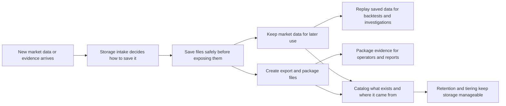
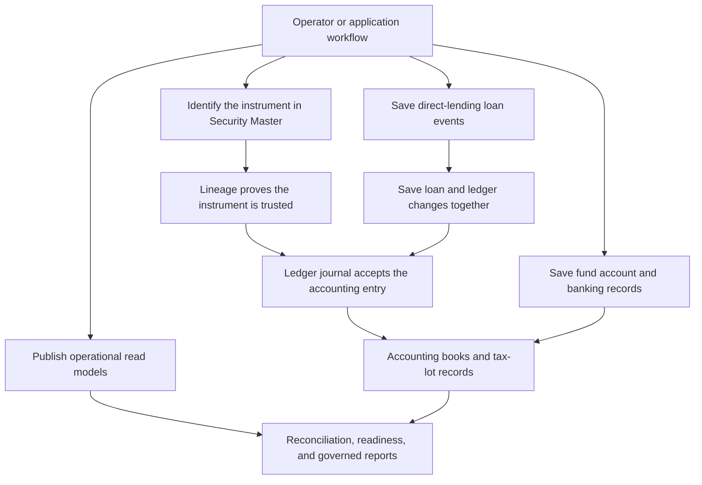

# src/Meridian.Storage

## Purpose

`src/Meridian.Storage` is Meridian's record-keeping layer. When market data, accounting entries,
loan events, exports, or operator evidence need to survive a restart, this project decides where and
how those records are saved.

Storage answers three questions:

1. **Can we keep this record safely?** Durable writes go through guarded helpers before they become
   evidence. A write-ahead log records the intended change first, so Meridian can recover or replay
   the write after a crash. An atomic file writer writes a complete replacement file first, then
   swaps it into place so readers do not see a half-written file.
2. **Where can we find it later?** Catalog, lineage, quality, search, and replay services track
   saved records so operators can locate them for audits, backtests, reconciliations, and reports.
3. **Where is the data coming from?** Ledger, Security Master, fund-account, and asset-operation
   stores keep source and approval details so accounting and investment-operation decisions can be
   explained later.

## Layer responsibility

Storage is responsible for saving, retrieving, and protecting records reliably. Other Meridian
layers decide the user workflow and screen presentation; Storage supplies the durable records,
lookup paths, and evidence trails those layers rely on.

## Key folders and files

- `Archival/` - safety tools for file-backed records, including the write-ahead log and atomic file
  writer.
- `Backfill/` - durable last-run backfill status plus per-symbol checkpoint and bar-count sidecars
  published under `Meridian.Storage.Backfill`.
- `Config/StorageConfigExtensions.cs` - Storage-owned mapping from shared `StorageConfig` values
  into `StorageOptions`, including naming convention, date partition, sink, and profile defaults.
- `Coordination/` - file-backed shared-storage lease store implementation published under
  `Meridian.Storage.Coordination` for contracts-owned `Meridian.Contracts.Coordination` records.
- `Etl/` - ETL staging, audit, reject, and local JSON job-definition stores.
- `Interfaces/` and `Sinks/` - contracts and implementations that receive data to be saved.
- `Store/`, `Policies/`, and `Replay/` - JSONL market-data storage, rules for using it, and readers
  that can play saved data back.
- `Services/CanonicalSymbolRegistry.cs` - storage-backed canonical symbol resolver implementing
  the contracts-owned `ICanonicalSymbolRegistry` over the symbol registry store.
- `Ledger/` - accounting journal storage, tax-lot policy inputs, and guardrails for instrument
  postings.
- `Integrations/` - file-backed provider integration manifest, connection, raw payload,
  quarantine, quarantine-review decision, quarantine replay payload, staging-record, and
  reconciliation-handoff evidence persistence for replayable no-code provider intake.
- `SecurityMaster/` - reference-data stores that identify securities and preserve provenance.
- `DirectLending/` - direct-lending state, events, workflow audit, and transactional ledger handoff.
- `AssetOperations/` - read-model projections for operational terms, lifecycle, cash flow,
  reconciliation, readiness, and evidence views.
- `FundAccounts/`, `Banking/`, and `FundStructure/` - fund accounts, balances, statements, banking
  records, and fund-structure persistence. Banking transaction persistence keeps bank-side evidence
  amounts, dates, external references, void posture, and retaining operator identity durable for
  cash-reconciliation audit packages. `FundStructure` owns the local JSON and in-memory
  fund-structure state stores, while PostgreSQL fund-structure service persistence stays in the
  storage-backed rows and migrations.
- `Packaging/`, `Export/`, and `Maintenance/` - portable data packages, analysis exports, retention,
  tiering, and scheduled cleanup.

## Important workflows

### Market data and evidence

Market data and evidence records enter through storage sinks. File-backed writes use the
write-ahead log or atomic file helpers so a crash is less likely to leave a half-written record.
Storage sink flush behavior uses the Core-owned `Meridian.Core.Services.IFlushable` contract rather
than an Application service dependency. Saved records feed replay, packaging, exports, catalog
lookup, lineage checks, quality scoring, and maintenance jobs.

Backfill status and checkpoint sidecars are Storage-owned durable records published under
`Meridian.Storage.Backfill`. They persist the shared Contracts-owned
`Meridian.Contracts.Backfill` result payload plus per-symbol checkpoint and bar-count maps under
the storage root through `AtomicFileWriter`, allowing interrupted jobs to resume without
Application owning file persistence details.

Shared-storage coordination lease persistence is Storage-owned durable state. The
`SharedStorageCoordinationStore` in `Meridian.Storage.Coordination` persists Contracts-owned
lease records under the configured
coordination root with per-resource lock files and `AtomicFileWriter`; Platform owns lease renewal,
coordinator election, split-brain detection, scheduled-work ownership, and subscription ownership
decisions, while Application consumes those services through the shared contracts.

Storage profile presets preserve existing persisted identifiers. The default profile ID remains
`Research` for compatibility, while APIs and operator surfaces display that preset as `Strategy`
for historical analysis, backtesting, and paper-validation preparation. The `Archival` preset keeps
long-retention evidence moving through hot, warm, cold, and archive tiers. `Config/StorageConfigExtensions.cs`
keeps the shared AppConfig storage section-to-`StorageOptions` mapping in the same project that owns
the durable storage option types and profile presets.

Canonical symbol resolution is Storage-owned because it wraps the durable symbol registry and its
identifier indexes. Application composition registers the Storage implementation behind
`Meridian.Contracts.Catalog.ICanonicalSymbolRegistry` for canonicalization and Security Master seed
workflows.

### Accounting and Security Master evidence

Ledger journal writes fail closed for instrument-bearing postings. In practice, this means Meridian
will not save a securities, dividend, accrued-interest, corporate-action, option, futures, short, or
symbol-scoped accounting line unless the line carries approved Security Master provenance and ledger
mapping evidence for the same instrument. This prevents an accounting entry from claiming one
symbol at the journal level while posting a different instrument line underneath it. Until durable
journal writes carry line-level Security Master ids, one journal entry may not combine multiple
instrument symbols behind one entry-level Security Master id.

Ledger journal writes that opt into treasury-ledger metadata also fail closed. When a posting carries
effective-date, idempotency, fund-event, capital-account, investor, payment-intent, or settlement
metadata, `LedgerPeriodPostingGuard` requires an effective date inside the target accounting period
and a non-empty idempotency key before the write can reach Postgres. Partial fund-event context must
also include fund event id, fund event type, and capital account id so private-capital postings can
be reconstructed from durable journal evidence. Postgres journal storage also keeps partial unique
indexes for aggregate-scoped command id, source event id, and normalized metadata idempotency key so
retry attempts fail closed at the durable ledger boundary instead of relying only on caller-side
checks. When LedgerJournalEntryWrite carries an AccountingPostingCommandDto, storage normalizes the write metadata from that command and rejects missing command identity, mismatched aggregate/period/ledger-book scope, pending reviewer state, non-human material origin, missing evidence/rationale, or correction intents without source journal lineage before append.

Ledger period close writes also fail closed for reviewed automation. `PostgresLedgerBookService`
rejects assistant or automation-origin close requests before saving the period status, period-close
event, or operator inbox sign-off work item so period locks remain human-approved accounting
records.

Ledger tax-lot state is stored as account-scoped policy records plus open-lot records in the ledger
schema. The storage layer keeps the FIFO/LIFO/HIFO/SpecificId policy inputs and open-lot balances;
relief projection, approval workflow, and tax-reporting exports remain outside this project.
Closed-period trial-balance financials now preserve the dimension envelope available on retained
journal metadata when building report rows. The ledger book service groups balances by account and
dimension key, then fills the book fund profile as the default fund dimension, so entity,
strategy, capital-account, instrument, cost-center, counterparty, and external GL context is not
lost before browser, WPF, reporting, or export callers consume the shared report DTO.
When a governed draft candidate emits line-entry keyed dimension tags, closed-period financials
prefer those line-specific dimensions before falling back to journal-level tags. This lets generated
multi-line postings retain different cost-center or external-GL scope per line while the underlying
ledger engine remains immutable and posting-gated.
Ledger-period summaries count open reconciliation breaks only when the operator work item carries
explicit ledger-period or ledger-book scope in its route, audit reference, or scope metadata; global
inbox breaks no longer leak into unrelated book closes.
New ledger writes persist the first-class `LedgerEntry.Dimensions` value into
`journal_legs.dimensions` as JSONB and rehydrate it with each ledger line. The metadata-tag path
remains a compatibility fallback for older retained rows, but new dimensional accounting evidence
should use the line property so reports, external-GL mapping, close checks, and future query
filters do not have to infer line scope from journal-level tags.
`PostgresLedgerJournalStore.QueryAsync` provides the first durable journal-read seam for those
line dimensions: callers can combine ledger-book, period, aggregate, account, date, and line-level
dimension filters, and the store applies them against `journal_legs.dimensions` instead of
guessing scope from account names or browser/WPF state. Empty queries fail before opening a
connection so production journal reads stay explicitly scoped.

### Direct lending and operational projections

Direct-lending persistence normally shares the Security Master storage lane. When
`MERIDIAN_SECURITY_MASTER_CONNECTION_STRING` is configured, direct-lending state, events, accruals,
cash transactions, allocations, fees, projected cash flows, workflow audit, journals, reconciliation
records, servicer reports, outbox records, and checkpoints use that connection and schema unless a
legacy `MERIDIAN_DIRECT_LENDING_*` override is explicitly supplied.

Direct-lending saves can also include projected ledger journals in the same database transaction as
the loan event append. If the ledger append fails, the loan state, event, projection, and outbox
write roll back together instead of leaving the books and loan record out of sync.
Direct-lending outbox polling claims pending messages with a PostgreSQL `FOR UPDATE SKIP LOCKED`
update and moves `visible_after` forward as a short lease before returning work to a dispatcher.
That keeps multiple hosted workers from processing the same message concurrently while still
allowing abandoned messages to become visible again after the lease window. Outbox inserts are
idempotent on `(topic, message_key)` so retried loan saves do not enqueue duplicate dispatcher work
for the same domain event. The Application-owned dispatcher also bounds configured batch size and
poll interval values before calling this store so bad environment overrides cannot make the
database-backed worker ineffective or spin in a tight retry loop.

Asset Operations persistence stays separate from `security_master`. Its default schema is
`asset_operations`, configured by `MERIDIAN_ASSET_OPERATIONS_CONNECTION_STRING` and
`MERIDIAN_ASSET_OPERATIONS_SCHEMA`, so Direct Lending, bonds, and later asset classes can publish
shared operational read models without moving servicing or accounting command tables into Security
Master storage.

Fund-structure local-first persistence uses Storage-owned state stores. The JSON-backed store writes
complete snapshots through `AtomicFileWriter`, and the in-memory store preserves the same snapshot
shape for deterministic tests and local workflows while Application keeps orchestration and service
composition.

ETL local job definitions are also Storage-owned. The JSON-backed `EtlJobDefinitionStore` writes
operator-created ETL definitions under the storage root using `AtomicFileWriter`; Application wires
the store through the shared `Meridian.Contracts.Etl` contract.

Provider integration manifests are Storage-owned durable configuration and evidence records. The
file-backed integration store persists approved manifests, connection instances, raw payloads,
quarantined records, staging records, and sync-run summaries under the resolved data root using
`AtomicFileWriter` so monitoring can explain run status and mapping changes can replay retained
source payloads without reacquiring provider data. Workstation-hosted flows can request a
tenant-scoped store partition so provider manifests, connections, dry-run evidence, and activation
state remain isolated by the authenticated tenant session.

Accounting configuration persistence keeps rich posting-rule payloads and saved Accounting Rules
Studio regression cases as durable workspace-owned records. PostgreSQL stores saved rule test cases
in `accounting_configuration_rule_test_cases` so service-owned dry-run regression suites round-trip
beside chart accounts, journal templates, posting rules, and configuration audit events. Durable
configuration workspaces are scoped by fund profile plus a non-null configuration scope derived
from `LedgerBookId`, and chart/template/rule/test-case child rows use the same scope so a fund can
retain separate primary, GAAP, tax, or shadow-book rule studios without delete/replace operations
crossing ledger-book boundaries. The ledger-book scope migration drops and recreates the scoped
workspace foreign keys before rebuilding composite keys, keeping migration replay compatible with
operational schema validation.
PostgreSQL accounting configuration workspaces are now keyed by tenant, company, fund profile, and
configuration scope, and chart/template/rule/test-case child rows use the same composite scope.
Audit reads filter by retained `tenant_id` and `company_id` when shared endpoints supply
authenticated tenant/company context, keeping Postgres-backed Rules Studio audit history isolated
across tenant/company boundaries.

## Glossary

- **Atomic file write** - write a complete new file in a temporary location first, then swap it into
  place in one step so readers never see a partial file.
- **Lineage** - metadata that explains where a record came from and why it is trusted.
- **Security Master** - Meridian's source of truth for identifying securities and financial
  instruments.
- **Tax lot** - the specific quantity of an instrument bought or sold at a known price and date.
- **Write-ahead log (WAL)** - a crash-safety log that records intended changes before the final
  storage file is updated, making recovery possible if the process stops mid-write.

## Diagrams

The storage module participates in the repository-level `DIA-ASSURANCE-LOOP` in
`docs/source/data/diagram-index.yml`. The diagrams below show the local storage flows in less
technical terms.

### How saved market data becomes reusable evidence



### How accounting and investment records stay tied together



## Roadmap traceability

<!-- source-roadmap-traceability:begin module=SRC-STORAGE -->
| Roadmap item | Title |
| --- | --- |
| `W1-DATA-001` | Provider trust gate and data confidence baseline |
| `W2-TRD-001` | Paper trading cockpit reliability |
| `W4-RECON-001` | Portfolio ledger reconciliation readiness |
| `W4-RPT-001` | Governed report pack readiness |
| `W5-ACCT-001` | Accounting records and operational evidence |
<!-- source-roadmap-traceability:end -->

## TODO checklist

<!-- source-todos:begin module=SRC-STORAGE -->
- No registry-backed TODOs are open for this module.
<!-- source-todos:end -->

## Validation

```bash
dotnet build src/Meridian.Storage/Meridian.Storage.csproj /p:EnableWindowsTargeting=true /p:NodeReuse=false
dotnet test tests/Meridian.Tests/Meridian.Tests.csproj --filter "FullyQualifiedName~LeaseManagerTests|FullyQualifiedName~IngestionJobServiceCoordinationTests|FullyQualifiedName~SubscriptionOrchestratorCoordinationTests" --logger "console;verbosity=normal" /p:EnableWindowsTargeting=true /p:NodeReuse=false
dotnet test tests/Meridian.Tests/Meridian.Tests.csproj --filter "Category!=Integration" --logger "console;verbosity=normal"
```

## Change rules

Route durable writes through WAL or atomic file helpers. Avoid direct unguarded file writes for evidence-bearing data.

## Related docs

- `docs/architecture/module-map.md`
- `docs/development/build-observability.md`
- `docs/source/generated/source-roadmap-traceability.md`
