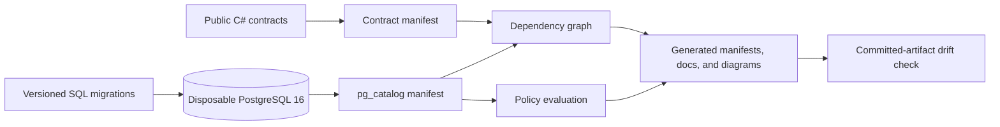

# PostgreSQL Schema Control

Meridian schema control is a self-auditing pipeline for the PostgreSQL migrations and public C#
data contracts used by the program. It builds a disposable database, extracts PostgreSQL-specific
metadata from `pg_catalog`, evaluates governance rules, and produces deterministic manifests,
Mermaid diagrams, and review reports.

It does not update a production database from application models. SQL migrations remain the
authoritative physical schema, while C# DTOs and related public contract objects are catalogued as
a separate layer. Database-to-contract links in `database/schema-control.json` are explicit module
associations and never imply that a DTO and a table are structurally identical.

## Pipeline


```mermaid
flowchart LR
    Contracts[Public C# contracts] --> ContractCatalog[Contract manifest]
    Migrations[Versioned SQL migrations] --> Candidate[(Disposable PostgreSQL 16)]
    Candidate --> Catalog[pg_catalog manifest]
    Catalog --> Policies[Policy evaluation]
    ContractCatalog --> Dependencies[Dependency graph]
    Catalog --> Dependencies
    Policies --> Artifacts[Generated manifests, docs, and diagrams]
    Dependencies --> Artifacts
    Artifacts --> Drift[Committed-artifact drift check]
```

The registry currently covers the ten SQL migration modules under `Meridian.Storage` and
`Meridian.Identity`. Direct Lending remains a distinct migration module even though its default
physical location is the `security_master` schema.

## Commands

Run commands from the repository root:

```powershell
# Resolve the intended baseline once; retain this SHA for repeatable comparisons.
$baselineSha = git rev-parse --verify 'origin/main^{commit}'

# Fast checks that do not need PostgreSQL.
python build/scripts/schema-control.py inventory --base-ref $baselineSha

# Verify with Docker; each invocation owns a fresh PostgreSQL container and candidate directory.
python -m pip install --requirement tools/schema_control/requirements.txt
python build/scripts/schema-control.py local `
  --base-ref $baselineSha

# Build a retained snapshot for review using the same disposable lifecycle.
python build/scripts/schema-control.py local --mode snapshot `
  --base-ref $baselineSha

# After reviewing the printed candidate directory, explicitly promote that snapshot.
python build/scripts/schema-control.py promote `
  --candidate-root build/schema-control/runs/<run-id>/candidate
```

`local` requires Python dependencies above and a running Docker daemon. It defaults to `verify`,
uses the registry's pinned `manifest.postgres_image`, and supports `--image` and
`--readiness-timeout <seconds>` overrides. Docker atomically allocates a loopback host port; no
port selection, pre-existing database, or database reset is needed. Every invocation allocates a
unique container and `build/schema-control/runs/<run-id>/candidate`, including concurrent runs in
the same checkout or different Git worktrees. It waits for a successful PostgreSQL query through
the mapped host port before invoking the existing `verify` or `snapshot` command.

Run directories are retained on success, failure, and cancellation. They contain `run.json`
(lifecycle, resource identity, exit status, and cleanup result), `docker.log`, `verification.log`,
`postgres.log`, and any generated candidate manifests and reports. The command prints the exact
artifact directory. It stops and reaps verification before capturing PostgreSQL logs and removing
only its owned container and associated disposable storage. Ctrl+C and termination signals trigger
cleanup; SIGKILL, machine shutdown, or a disconnected Docker daemon cannot guarantee cleanup.
Use the recorded container identity and ownership labels to inspect any reported cleanup failure;
avoid blanket container or volume pruning. Retained artifacts can be deleted when no longer needed.

`local --mode snapshot` never promotes artifacts. Review its retained candidate and use `promote`
with that exact directory, then run `local` again to verify the promoted outputs.

`snapshot` and `verify` enforce a disposable, empty database preflight before running any DDL. The
hosted workflow supplies a fresh database and still uses these lower-level commands with
`--database-url` and `--candidate-root`. For local work, prefer the owned `local` wrapper.

### Baseline and candidate evidence

Pull-request runs use `github.event.pull_request.base.sha` as the migration comparison baseline.
The candidate SHA identifies the commit actually checked out by Actions; for pull requests this is
normally GitHub's merge commit. Advancing `origin/main` cannot change the comparison for the same
recorded candidate/baseline pair.

Manual `check` and `snapshot` runs require an explicit `baseline_ref` input. Supply a full commit
SHA for repeatable runs, or a Git ref that the workflow resolves once before running checks:

```powershell
gh workflow run schema-control.yml --ref <branch> -f mode=snapshot -f baseline_ref=<baseline-sha>
```

The workflow uploads `build/schema-control/revisions.json` and adds both resolved SHAs to its
step summary before testing. The CLI also writes `candidate/reports/revisions.json` and includes
both SHAs in the candidate summary, including migration-safety failures. Local CLI evidence records
whether the working tree is dirty; a local run without Git or without `--base-ref` reports the
unavailable identity as `null`. Baseline-free runs do not perform baseline migration checks.

To reproduce a comparison, check out the recorded candidate SHA, pass the recorded baseline SHA
to `--base-ref`, and use a fresh disposable database. Keep the working tree clean to reproduce the
recorded candidate. Revision evidence belongs only to run reports and is excluded from the
tracked manifests and generated documentation, so committing regenerated artifacts does not
change their contents solely because the candidate SHA changed.

## Source and output ownership

| Layer | Canonical source | Generated output |
| --- | --- | --- |
| Migration modules and schema placement | `database/schema-control.json` | `database/manifest/migrations.json` |
| Physical PostgreSQL objects | SQL migrations plus a migrated PostgreSQL catalog | `database/manifest/catalog.json`, `database/manifest/schemas/*.json` |
| Public DTOs and data objects | C# source configured by `contract_sets` | `database/manifest/contracts.json` |
| Cross-object relationships | PostgreSQL dependencies, C# type references, and explicit registry edges | `database/manifest/dependencies.json` |
| Governance | `database/policies/*.json` | `database/manifest/policies.json` and candidate reports |
| Human-readable reference | The generated manifests above | `docs/generated/database/**` |

The lower-level commands default to `build/schema-control/candidate/`; `local` always uses its
unique retained run directory. Only `promote` writes to the tracked
manifest and documentation roots, and it must be followed by `verify` in GitHub Actions.
Configured output roots must resolve to a non-root path within the repository; schema control
rejects absolute paths, repository escapes, and symlinks that resolve outside the checkout.

## Policy behavior

The policy engine currently checks primary keys, foreign-key index coverage, use of the `public`
schema, table comments, selected row-level security expectations, and legacy reapply migration
modules. Migration checks separately enforce registered directories, unique tracked ordinals,
immutable applied history, reviewed removal waivers, and destructive-change detection for new SQL.

Policy severities and narrowly reviewed exceptions belong in `database/policies/`; do not suppress
checks in the workflow or generator.

## Extending the catalog

When adding a PostgreSQL-backed module:

1. Add its SQL migration directory and real runner settings to `migration_sets`.
2. Add the relevant contract directory or namespace to `contract_sets` when one exists.
3. Declare only cross-module dependencies that PostgreSQL or C# cannot discover directly.
4. Run the inventory tests and a hosted `snapshot` dispatch.
5. Review, promote, and verify the generated manifests and diagrams in the same pull request.
